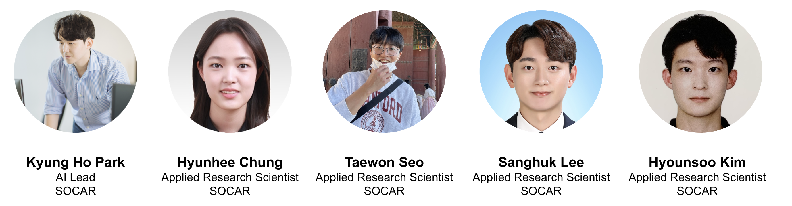

# Foundational Model for Visual Perception (FM4VP) Challenge

in accordance with VPLOW at CVPR 2023

{% include figure.html img="car-images.png" alt="intro image here" caption="SOFAR (SOCAR: Socially-Obtained CAR image dataset" width="99%" %}

## Introduction

FM4VP Challenge is a challenge in accordance with Visual Perception via Learning in an Open World (VPLOW), held in CVPR 2023.

## Orgainizers

The FM4VP Challenge 2023 is hosted by SOCAR. SOCAR is the largest car-sharing platform in Repbulic of Korea, providing a seamless mobility experience from car, public transportations, parking lots, electric bike, and even autonomous vehicles. The organizers are applied research scientists at SOCAR, and currently researching/developing on AI products for the business impact in the real world.

## Problem Statement: Zero/Few-shot Image Classification with Foundational Models

## Dataset
In this challenge, we are releasing SOCAR (Socially-Obtained CAR) dataset, which includes 10K 

The training set includes 13 classes, and each classes represents car's status where the car-sharing platform can easily understand.

* Exterior Normal
* Exterior Damage
* Bubble Wash
* Car in a Washing machine
* Dashboard
* Cupholder
* Glovebox
* Washer Fluid
* Front Seat
* Read Seat
* Trunk
* Clean Sheet
* Tire

In a Support set (which can be used under the few-shot learning setting), we provide 6 additional classes which cannot be easily expected in the real world. Under the open-world setting, it becomes more challenging as the pattern of these classes are diverse, and cannot be expected a priori.

* Exterior Dirt
* Dirty Cupholder
* Dirty Sheet
* Dirty Seat
* Car in a rainy day
* Car in a snowy day

In the Test set, we provide total 19 classes of car's status, which concatenates classes at both Training and Support set.

## Evaluation

In this FM4VP Challenge 2023, we will measure Macro F1 score as an evaluation metric. Under the given Test set, participants submit prediction results at each corresponing test samples. The submission format (.csv) is included in the dataset. After the participants submit their file to the submission site, it will be uploaded to the leaderboard.

## Important Dates:

* May 10, 2023: Release of Training Set and Validation Set
* May 15, 2023: Leaderboard Open
* June 15, 2023: Challenge Deadline
* June 18, 2023: VPLOW workshop

Please Note that every deadlines are 23:59 in AoE timezone except for the VPLOW workshop date.

## Contact:

* Kyung Ho Park (kp@socar.kr)
* Hyunhee Chung (esther@socar.kr)
* Taewon Seo (cillian@socar.kr)
* Sanghuk Lee (leonard@socar.kr)
* Hyounsoo Kim (lucci@socar.kr)

Hosted by [SOCAR](https://www.socar.kr/), {{ site.pub_year }}.
 
> built using [Jekyll](https://jekyllrb.com/) and [GitHub Pages](https://pages.github.com/)
>
> images and content: cc-by-sa <a href="https://github.com/{{ site.github_username }}">{{ site.author }}</a> {{ site.pub_year}} (get [source code]({{ site.repo }})).
> Last build date: {{ site.time | date: "%Y-%m-%d" }}.
>
> 
