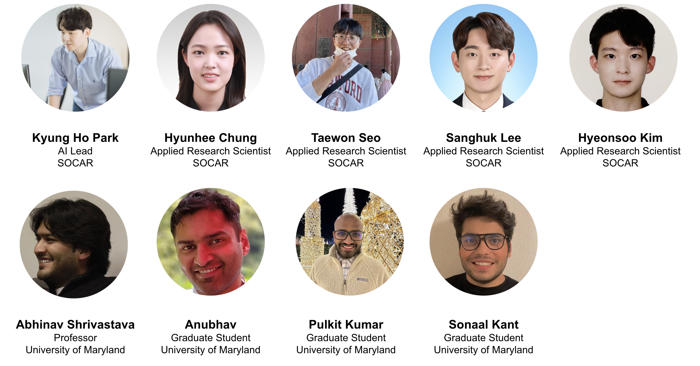

# Foundational Model without Descriptive Caption (FMDC) Challenge

in accordance with [VPLOW workshop](https://vplow.github.io/vplow_3rd.html) at CVPR 2023, Vancouver, Canada.

{% include figure.html img="car-images.png" alt="intro image here" caption="SOFAR (SOCAR: Socially-Obtained CAR image dataset" width="99%" %}
 

## Introduction

This year, in accordance with Visual Perception via Learning in an Open World (VPLOW) workshop, we are organizing Foundational Model without Descriptive Caption (FMDC) challenge in CVPR 2023. This year's FMDC challenge proposes a zero-shot/few-shot image classification problem leveraging FMs (i.e., CLIP, CoCa), to deal with novel samples in the real world. From an industry perspective, when novel samples occur in the business, we may retrieve and annotate every novel sample to re-train the model. However, it becomes too expensive if we perform this procedure whenever novel samples occur. To this end, utilizing the zero-shot/few-shot classification ability of recently-proposed foundational models can be a reasonable & presumable solution. Therefore, we hereby aim to empower candidate workshop participants to contemplate this challenge and let the students, researchers, and Machine Learning community access the industry-level dataset retrieved in the real world. 

 

<!-- 
 -->
## Organizers

The FMDC Challenge 2023 is hosted by SOCAR. SOCAR is the largest car-sharing platform in the Republic of Korea, providing a seamless mobility experience from cars, public transportation, parking lots, electric bike, and even autonomous vehicles. The organizers are Applied Research Scientists at SOCAR, and currently researching/developing AI products for business impact.

<!-- 
 -->

<!-- 
 -->
## Problem Statement: Zero/Few-shot Image Classification with Foundational Models

In this year's FMDC challenge, we propose a business problem called **car state classification** in the open world. A car state classification aims to recognize a car's various states (i.e., exterior damage, dirt, wash, etc.) that occur in the real world, especially at SOCAR, the largest car-sharing platform in the Republic of Korea. The SOCAR requires its users to take pictures of cars before they drive, in order to monitor the car's state. Based on these images, SOCAR establishes an image classifier that identifies the car's various states and performs follow-up business actions for efficient business operation (i.e., washing the car if 'exterior dirt' is detected, sending the car for repair if harsh damage is detected). The most challenging part of managing this classifier is dealing with novel samples occurring in the real world. For example, how can we identify novel patterns of dirty cars? How can we recognize novel damage patterns such as harsh car breakage or accident? To resolve these challenges, we propose the real-world car image dataset and encourage the participants to solve this problem. When we use (i.e., fine-tune) FMs in industry, one of the challenging hurdles is the lack of descriptive caption. While web-crawled large-scale datasets such as [LAION-5B]('https://laion.ai/blog/laion-5b/') have detailed captions on each image, real-world images usually have class-level or even weakly-labeled annotations. Then, what is an effective fine-tuning/transfer learning strategy for adapting FMs to the particular domain? This will be a good starting point for your journey to this challenge.
<!-- 
 -->

<!-- 
 -->
## Dataset

In this challenge, we are releasing SOCAR (Socially-Obtained CAR) dataset, which includes ten-thousand car images retrieved from our  car-sharing operation. For a detailed description of the SOCAR dataset, please refer to the paper [SOCAR: Socially-Obtained CAR Dataset for Image Recognition in the Wild]('https://openaccess.thecvf.com/content/WACV2023W/DNOW/papers/Seo_SOCAR_Socially-Obtained_CAR_Dataset_for_Image_Recognition_in_the_Wild_WACVW_2023_paper.pdf')

The **Training Set** includes 13 classes, each representing car's status that the car-sharing platform can easily understand.

* Exterior Normal
* Exterior Damage
* Bubble Wash
* Car in a Washing machine
* Dashboard
* Cupholder
* Glovebox
* Washer Fluid
* Front Seat
* Read Seat
* Trunk
* Clean Sheet
* Tire

In a **Support Set** (which can be used under the few-shot learning setting), we provide 6 additional classes which cannot be easily expected in the real world. However, it becomes more challenging in the open-world setting as the pattern of these classes is diverse and cannot be expected a priori.

* Exterior Dirt
* Dirty Cupholder
* Dirty Sheet
* Dirty Seat
* Car on a rainy day
* Car on a snowy day

In the **Test Set**, we provide a total of 19 classes of car status, which concatenates classes at both the Training and Support set.

<!-- 
 -->

 
<!-- 
 -->
## Evaluation
We will measure **Macro F1-Score** as an evaluation metric. For the given Test set, participants submit prediction results at corresponing test samples. The submission format (.csv) is included in the dataset. After the participants submit their file to the submission site, the results will be uploaded to the leaderboard.

<!-- 
 -->
 
<!-- 
 -->
## Important Dates:
* May 13, 2023: Dataset Release and Challenge Start
* May 19, 2023: Leaderboard Open
* June 17, 2023: Challenge Deadline
* June 18, 2023: VPLOW workshop

Please Note that each deadline is 23:59 in the PST timezone.

<!-- 
 -->

## Presentation
To be updated soon!

 
<!-- 
 -->
## Contact
* Kyung Ho Park (kp[at]socar[dot]kr)
* Hyunhee Chung (esther[at]socar[dot]kr)
* Taewon Seo (cillian[at]socar[dot]kr)
* Sanghuk Lee (leonard[at]socar[dot]kr)
* Hyeonsoo Kim (lucci[at]socar[dot]kr)

## Have a look at another Challenge
The VLPOW workshop also hosts Object Discovery Challenge [(OBJ-DISC)](https://obj-disc.github.io/). So please have a look and join it if you are interested! 

<!-- 
 -->

Hosted by [SOCAR](https://www.socar.kr/), {{ site.pub_year }}.
 
> built using [Jekyll](https://jekyllrb.com/) and [GitHub Pages](https://pages.github.com/)
>
> images and content: cc-by-sa <a href="https://github.com/{{ site.github_username }}">{{ site.author }}</a> {{ site.pub_year}} (get [source code]({{ site.repo }})).
> Last build date: {{ site.time | date: "%Y-%m-%d" }}.
>
> 
